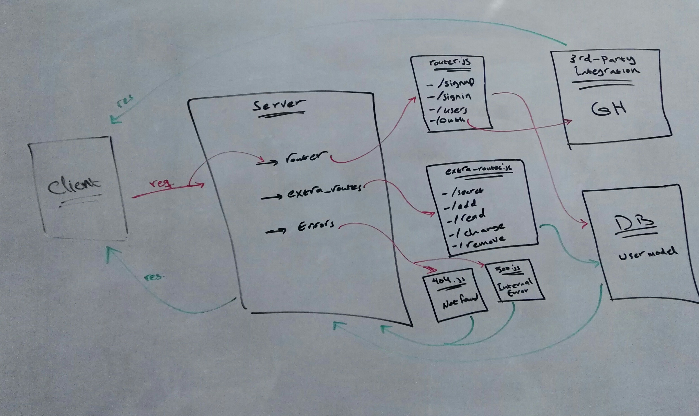

# auth-server :Authentication System.

# Author: Bushra Bilal.

# Links and Resourcs:

- [PR Link](https://github.com/bushra-401-advanced-javascript/auth-server/pull/1)
- [PR Link](https://github.com/bushra-401-advanced-javascript/auth-server/pull/2)
- [PR Link](https://github.com/bushra-401-advanced-javascript/auth-server/pull/3)
- [PR Link](https://github.com/bushra-401-advanced-javascript/auth-server/pull/4)

# Setup:

- Enviroument Variables:
  - PORT=3000
  - MONGODB_URI='mongodb://localhost:27017/auth-db'
  - SECRET='auth_secret'
  - CLIENT_ID=86e3aff572ac577ad14b
  - CLIENT_SECRETE=a98876dba7cbdf9ae4e0f3e9a72c52ab6cc93f93
  - TOKEN_SERVER_URL='https://github.com/login/oauth/access_token'
  - REMOTE_USER_API='https://api.github.com/user'
  - API_SERVER='http://localhost:3000/oauth'

  ## How to initialize/run your application: 

  - clone app's repo

  - install the packages:  
    `npm i`

  - to run the server:  
    `node index.js`

  - hit the routes using Postman/Swagger:  
    - Sign-up route - POST: `http://localhost:3000/signup/`  
      - body: 
         ```js
         {
           "username": "anyusername",
           "password": "anypassword"
         }
    - Sign-in route - POST: `http://localhost:3000/signin/`  
      - basic Auth:  
       `username & pssword`
    - Get all users - GET: `http://localhost:3000/users/` 

    - add - POST:  
     `http://localhost:3000/add`

    - read - GET:   
    `http://localhost:3000/read`

    - change - PUT:  
     `http://localhost:3000/change`

    - delete - DELETE:  
     `http://localhost:3000/delete`

# UML
